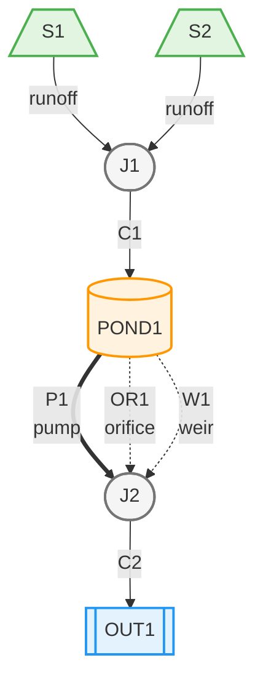

# GoldSim-SWMM Bridge

A DLL bridge that enables GoldSim simulation software to control EPA SWMM hydraulic simulations, pass rainfall inputs, and receive runoff calculations.

Latest Version: 1.05 

## 📁 Complete Working Example Available!

A comprehensive example demonstrating **all 3 controllable input types** is ready to use in the `examples/` directory:

- **[examples/complete_control_example.inp](examples/complete_control_example.inp)** - SWMM model with rain gage, pump, and node inflow controls
- **[examples/QUICKSTART.md](examples/QUICKSTART.md)** - Step-by-step setup guide
- **[examples/README.md](examples/README.md)** - Detailed documentation
- **[examples/VALIDATION_CHECKLIST.md](examples/VALIDATION_CHECKLIST.md)** - Testing checklist

**Quick test:**
```batch
python generate_mapping.py examples\complete_control_example.inp
```

## Quick Start

### Required Files

**All files in your GoldSim model directory:**
- `YourModel.gsm` - Your GoldSim model
- `model.inp` - SWMM input file (**MUST be named exactly "model.inp"**)
- `SwmmGoldSimBridge.json` - Interface mapping file (generated from model.inp)
- `GSswmm.dll` - Bridge DLL (from x64/Release/)
- `swmm5.dll` - SWMM engine (MUST be in same directory as GSswmm.dll)

**Important:** The SWMM input file must be named `model.inp` - this is hardcoded in the bridge DLL. If your file has a different name, rename it to `model.inp` before using with GoldSim.

**Output files** (model.out, model.rpt, bridge_debug.log) are automatically created in the same directory during simulation.

### Preparing Your SWMM Model for GoldSim Control

The bridge allows GoldSim to control various SWMM elements by using the special keyword **`DUMMY`** in your SWMM input file. When the parser finds `DUMMY` references, it creates dynamic inputs that GoldSim can control during simulation.

#### Understanding the DUMMY Keyword

**What is DUMMY?**
- `DUMMY` is a special placeholder keyword that signals: "This element will be controlled by GoldSim, not by the .inp file data"
- The term "DUMMY" is not an EPA SWMM term - it's a convention we chose for this bridge to clearly indicate external control
- You could technically use any name (like "EXTERNAL" or "GOLDSIM"), but DUMMY is clear and commonly used in programming for placeholder values
- It appears in two places for each controlled element:
  1. **In the element definition** (e.g., `TIMESERIES DUMMY` in [RAINGAGES]) - tells our parser this is GoldSim-controlled
  2. **In the data section** (e.g., DUMMY entry in [TIMESERIES]) - placeholder to satisfy SWMM's validation requirements

**Why the placeholder?**
- SWMM validates all references when loading the .inp file
- If you reference `TIMESERIES DUMMY` but don't define it in [TIMESERIES], SWMM will fail with "undefined time series" error
- The placeholder values (like 0.0 for rainfall) are never actually used - GoldSim's values override them at runtime

**Think of it this way:**
- DUMMY reference = "GoldSim controls this" (signal to our parser)
- DUMMY placeholder = "Keep SWMM's validator happy" (required by SWMM)
- GoldSim values = What actually gets used during simulation

#### Supported Input Types

The bridge supports **3 types of dynamic inputs** from GoldSim to SWMM:

1. **Rain Gages** - Control rainfall intensity
2. **Pumps** - Control pump speed/flow (primary method for flow control)
3. **Node Inflows** - Control lateral inflow at nodes

**Note:** Orifices and weirs are NOT controllable from GoldSim. These are passive hydraulic structures that respond to water levels according to their design geometry. Use pumps for active flow control. Orifice and weir flows can be monitored as outputs.

**Plus:** Elapsed time is always included as the first input (index 0).

#### How to Configure Each Input Type

##### 1. Rain Gages (Rainfall Control)

In the `[RAINGAGES]` section, set the timeseries to `DUMMY`:

```
[RAINGAGES]
;;Name           Format    Interval SCF      Source
RG1              INTENSITY 0:05     1.0      TIMESERIES DUMMY
```

Also add a placeholder timeseries (required by SWMM parser):

```
[TIMESERIES]
;;Name   Date       Time       Value
DUMMY              0:00       0.0
```

**Why both places?**
- The `TIMESERIES DUMMY` reference in [RAINGAGES] tells our parser: "This rain gage is controlled by GoldSim"
- The DUMMY entry in [TIMESERIES] is a placeholder to satisfy SWMM's validation - SWMM requires every referenced timeseries to exist, even if it's never used
- At runtime, GoldSim's rainfall values **override** the placeholder, so the 0.0 value is never actually used

**Result:** GoldSim can provide rainfall intensity values at each timestep.

##### 2. Pumps (Pump Control)

In the `[PUMPS]` section, set the pump curve (Pcurve) to `DUMMY`:

```
[PUMPS]
;;Name           From Node    To Node      Pcurve       Status   Startup Shutoff
P1               WET_WELL     OUTLET       DUMMY        ON       0       0
```

Also add a placeholder pump curve (required by SWMM parser):

```
[CURVES]
;;Name           Type       X-Value    Y-Value
DUMMY            Pump1      0          10
DUMMY                       1          10
```

**Why both places?**
- The `Pcurve DUMMY` reference in [PUMPS] tells our parser: "This pump is controlled by GoldSim"
- The DUMMY curve in [CURVES] is a placeholder to satisfy SWMM's validation
- At runtime, GoldSim's pump setting values **override** the placeholder curve

**Result:** GoldSim can control pump setting (0.0 = off, 1.0 = full speed).

**Important:** Pumps are the recommended method for active flow control in SWMM. Unlike orifices and weirs (which are passive hydraulic structures), pumps are designed for external control and work reliably with the API.

##### 3. Node Inflows (Lateral Inflow Control)

In the `[DWF]` (Dry Weather Flow) section, use `DUMMY` as a pattern name:

```
[DWF]
;;Node           Constituent      AvgValue   Pattern1   Pattern2   Pattern3   Pattern4
J1               FLOW             1.0        DUMMY      ""         ""         ""
```

Also add a placeholder pattern (required by SWMM parser):

```
[PATTERNS]
;;Name           Type       Multipliers
DUMMY            MONTHLY    1.0 1.0 1.0 1.0 1.0 1.0 1.0 1.0 1.0 1.0 1.0 1.0
```

**Note:** The pattern type (MONTHLY, DAILY, HOURLY, or WEEKEND) and multipliers are placeholders. SWMM requires the pattern to exist, but the values won't be used since GoldSim provides the actual lateral inflow values at runtime.

**Why both places?**
- The `DUMMY` pattern reference in [DWF] tells our parser: "This node inflow is controlled by GoldSim"
- The DUMMY pattern in [PATTERNS] is a placeholder to satisfy SWMM's validation
- At runtime, GoldSim's lateral inflow values **override** the placeholder pattern

**Result:** GoldSim can provide lateral inflow values (in flow units) at the node.

#### Multiple Inputs Example

You can combine multiple input types in one model:

```
[RAINGAGES]
RG1              INTENSITY 0:05     1.0      TIMESERIES DUMMY
RG2              INTENSITY 0:05     1.0      TIMESERIES DUMMY

[PUMPS]
P1               WET_WELL     J1           DUMMY        ON       0       0
P2               STORAGE      OUTLET       DUMMY        ON       0       0

[DWF]
J2               FLOW             1.0        DUMMY      ""         ""         ""
```

**Result:** GoldSim interface will have 6 inputs:
- Input 0: ElapsedTime (always present)
- Input 1: RG1 (rain gage)
- Input 2: RG2 (rain gage)
- Input 3: P1 (pump)
- Input 4: P2 (pump)
- Input 5: J2 (node inflow)

The inputs are assigned in priority order: rain gages, pumps, then node inflows.

**Note:** Orifices and weirs are passive hydraulic structures and cannot be controlled. Use pumps for active flow control.

### Generating the Mapping File

After preparing your SWMM model with `DUMMY` references, generate the mapping file:

```batch
python generate_mapping.py model.inp
```

This creates `SwmmGoldSimBridge.json` which defines:
- Number of inputs (elapsed time + all DUMMY-referenced elements)
- Number of outputs (storage nodes, outfalls, orifices, weirs, subcatchments)
- Element names and types for dynamic interface
- Priority order for inputs and outputs

**The script also validates your .inp file** and will report any errors that would prevent SWMM from running:
- Missing required sections
- Invalid XSECTIONS parameters (e.g., weirs with wrong parameter count)
- References to non-existent nodes
- Missing outfall nodes
- Invalid DUMMY references (elements that don't exist)

**Important:** Regenerate the mapping file whenever you:
- Add or remove DUMMY references
- Rename SWMM elements
- Change model structure (add/remove nodes, links, subcatchments)

#### Python Script Usage

**Basic Usage:**
```batch
python generate_mapping.py <path_to_inp_file>
```

**Examples:**
```batch
# Generate mapping from model.inp in current directory
python generate_mapping.py model.inp

# Generate mapping from model in subdirectory
python generate_mapping.py models\watershed.inp

# Generate mapping with full path
python generate_mapping.py C:\Projects\SWMM\model.inp
```

**Output:**
The script will display discovered inputs and outputs:
```
Processing: model.inp

Validating .inp file...
✓ No validation issues found

Successfully parsed 19 sections
  [CONDUITS]: 1 entries
  [JUNCTIONS]: 1 entries
  ...

Content hash: b3abaeafb29f61b34bbdfc37b672c616

Discovered 7 input(s):
  [0] ElapsedTime (SYSTEM)
  [1] RG1 (GAGE)
  [2] P1 (PUMP)
  [3] OR1 (ORIFICE)
  [4] W1 (WEIR)
  [5] J1 (NODE)

Discovered 6 output(s):
  [0] POND1 (STORAGE - VOLUME)
  [1] OUT1 (OUTFALL - FLOW)
  [2] OR1 (ORIFICE - FLOW)
  [3] W1 (WEIR - FLOW)
  [4] S1 (SUBCATCH - RUNOFF)
  ...

Generating mapping file: SwmmGoldSimBridge.json
Successfully generated: SwmmGoldSimBridge.json
Input count: 7
Output count: 6
```

**Input Discovery Priority:**
The parser discovers inputs in this order:
1. Elapsed time (always index 0)
2. Rain gages with TIMESERIES DUMMY
3. Pumps with Pcurve DUMMY
4. Nodes with DWF pattern DUMMY

**Output Discovery Priority:**
The parser discovers outputs in this order:
1. Storage nodes (volume)
2. Outfalls (flow)
3. Orifices (flow)
4. Weirs (flow)
5. Pumps (flow)
6. Subcatchments (runoff)

**Validation Errors:**
If the script finds errors, it will stop and display them:
```
Validation Issues Found:
  ERROR: Weir 'W1' with RECT_OPEN has 3 parameters - SWMM expects 2 or 4
    Current line: W1 RECT_OPEN 10 0 0
    Fix: Either use 2 params (height width) or 4 params (height width slope_left slope_right)
  ERROR: No outfalls defined - SWMM requires at least one outlet node

❌ CRITICAL ERRORS FOUND - Model will likely fail to run in SWMM
Please fix the errors above before using this model with GoldSim
```

**Requirements:**
- Python 3.6 or higher
- No external dependencies (uses standard library only)
- SWMM .inp file must be valid and readable

**When to Regenerate:**
- After adding/removing DUMMY references (rain gages, pumps, orifices, weirs, node inflows)
- After adding/removing storage nodes, outfalls, orifices, weirs, or subcatchments
- After renaming any SWMM elements
- When switching to a different SWMM model
- After fixing validation errors

### Visualizing Your Model

Generate a visual diagram of your SWMM model structure:

```batch
python generate_diagram.py model.inp
```

This creates a Mermaid.js diagram file (`model.mmd`) showing:
- **Subcatchments** (green trapezoids) with runoff connections
- **Junctions** (gray stadium shapes)
- **Storage nodes** (orange cylinders)
- **Outfalls** (blue hexagons)
- **Conduits** (solid arrows)
- **Orifices** (dotted arrows labeled "orifice")
- **Weirs** (dotted arrows labeled "weir")
- **Pumps** (thick arrows labeled "pump")

**Viewing the Diagram:**
1. **In VS Code**: Install "Markdown Preview Mermaid Support" extension
2. **On GitHub/GitLab**: Commit the `.mmd` file - renders automatically
3. **Online**: Copy/paste to https://mermaid.live

**Example Output:**

The diagram below shows a storage pond model with two subcatchments (S1, S2) draining to a junction (J1), which flows via conduit to a storage node (POND1). The pond releases water through a pump (P1), orifice (OR1), and weir (W1) to an outfall (OUT1).



This helps you:
- Understand model structure at a glance
- Document your model for reports
- Verify connections are correct
- Share model design with team members
- **Note:** Pumps shown with thick arrows (==>), orifices/weirs with dashed lines (-.->)

### DLL Configuration

The interface is **dynamic** based on your SWMM model:

```
Function Name:  SwmmGoldSimBridge  (case-sensitive!)
Inputs:         Determined by mapping file
                - inargs[0]: Elapsed time (seconds) - always present
                - inargs[1+]: DUMMY-referenced elements in priority order:
                  1. Rain gages (TIMESERIES DUMMY)
                  2. Pumps (Pcurve DUMMY)
                  3. Node inflows (DWF pattern DUMMY)
Outputs:        Determined by mapping file (in priority order):
                1. Storage node volumes
                2. Outfall flows
                3. Orifice flows
                4. Weir flows
                5. Pump flows
                6. Subcatchment runoff
Version:        1.05
```

**Simple Example:** A model with 1 DUMMY rain gage and 2 subcatchments:
- Inputs: 2 (elapsed time + 1 rain gage)
- Outputs: 2 (2 subcatchment runoff values)

**Complex Example:** A model with 2 rain gages, 1 pump, 1 orifice, 1 storage node, and 1 outfall:
- Inputs: 4 (elapsed time + 2 rain gages + 1 pump + 1 orifice)
- Outputs: 3 (1 storage volume + 1 outfall flow + 1 orifice flow)

#### Configuring GoldSim External Element

1. **Check Mapping File First:**
   - Open `SwmmGoldSimBridge.json` in a text editor
   - Note the `input_count` and `output_count` values
   - Review the `inputs` and `outputs` arrays to see element names

2. **Create External Element:**
   - In GoldSim, insert an External element
   - Set DLL file path to `GSswmm.dll` (or full path)
   - Set function name to `SwmmGoldSimBridge` (case-sensitive!)

3. **Configure Inputs:**
   - Set number of inputs to match `input_count` from mapping file
   - Input 0: Connect to GoldSim's ETime element (elapsed time in seconds)
   - Input 1+: Connect to data sources for each DUMMY element:
     - **Rain gages**: Rainfall intensity
       - US units (CFS, GPM, MGD): inches/hour
       - SI units (CMS, LPS): mm/hour
     - **Pumps**: Pump setting (0.0 = off, 1.0 = full speed)
     - **Orifices**: Gate opening (0.0 = closed, 1.0 = fully open)
     - **Weirs**: Gate opening (0.0 = closed, 1.0 = fully open)
     - **Node inflows**: Lateral flow rate (in model's FLOW_UNITS)
   - Input order must match the `inputs` array in the mapping file
   - Check your model.inp `[OPTIONS]` section for `FLOW_UNITS`

4. **Configure Outputs:**
   - Set number of outputs to match `output_count` from mapping file
   - Outputs will be populated in the order specified in mapping file
   - Check mapping file for element names and types

5. **Set Options:**
   - ☑ Run Cleanup after each realization (required)
   - ☐ Unload DLL after each use (optional)
   - ☑ Run in separate process space (required)

6. **Verify Configuration:**
   - Input count in GoldSim = `input_count` in mapping file
   - Output count in GoldSim = `output_count` in mapping file
   - All required files in same directory as .gsm file

### Setup Checklist
1. Copy DLLs and SWMM model to your GoldSim model directory
2. **Rename your SWMM file to `model.inp`** (required - filename is hardcoded)
3. **Prepare SWMM model:** Add DUMMY references for elements you want to control
4. **Generate mapping file:** `python generate_mapping.py model.inp`
5. Create External element in GoldSim
6. Set DLL file to `GSswmm.dll`
7. Set function name to `SwmmGoldSimBridge`
8. Add inputs/outputs as specified in mapping file
9. **Critical**: Set GoldSim time step = SWMM ROUTING_STEP
10. Enable "Run Cleanup after each realization"
11. Link inputs to data sources
12. Run simulation (F5)

## Examples

A complete working example demonstrating all 5 input types is available in the `examples/` directory:

- **`examples/complete_control_example.inp`** - SWMM model with all input types
- **`examples/README.md`** - Detailed example documentation
- **`examples/QUICKSTART.md`** - Step-by-step setup guide

To use the example:

```batch
# Generate mapping file
python generate_mapping.py examples\complete_control_example.inp

# Review discovered inputs/outputs
type SwmmGoldSimBridge.json

# Follow the QUICKSTART guide for GoldSim setup
```

The example demonstrates:
- Rain gage control (rainfall intensity)
- Pump control (on/off or proportional)
- Node inflow control (lateral flow)
- Passive monitoring of orifice and weir flows

## Example Setup

### Complete Example: Controlled Storage Pond

**See the `examples/` directory for a complete working example** with detailed documentation:
- `examples/complete_control_example.inp` - Full SWMM model
- `examples/README.md` - Detailed setup and usage guide
- `examples/QUICKSTART.md` - Step-by-step instructions

The example demonstrates:
- Rain gage control (rainfall intensity)
- Pump control (primary method for active flow control)
- Node inflow control (lateral flow at junctions)
- Passive monitoring of orifice and weir flows
- Stable pond hydraulics with proper sizing

### Basic Test Model

For initial testing with minimal complexity:

**SWMM Model Requirements:**
- At least one subcatchment defined
- Valid ROUTING_STEP (e.g., `0:05:00` for 5 minutes)
- Consistent FLOW_UNITS (CFS, CMS, etc.)
- At least one DUMMY reference (e.g., rain gage with TIMESERIES DUMMY)

**GoldSim External Element Settings:**
```
- Unload DLL after each use
- Run Cleanup after each realization  (required)
- Run in separate process space (required)
```

**Simple Test Configuration:**
1. **Inputs**: 
   - Elapsed Time: Use GoldSim's built-in ETime element
   - Rainfall: Constant 2.5 in/hr or time-varying storm
2. **Duration**: 2 hours minimum
3. **Time Step**: Must match SWMM routing step exactly
4. **Realizations**: Start with 1 for testing

**Expected behavior:**
- Runoff starts at 0
- Increases during rainfall
- Peaks after rainfall (lag time)
- Gradually recedes

## Common Issues

| Problem | Solution |
|---------|----------|
| "Cannot load DLL" | Copy DLL to model directory |
| "Cannot find function" | Check spelling: `SwmmGoldSimBridge` |
| "Argument mismatch" | Check mapping file for correct input/output counts |
| "Mapping file not found" | Run `python generate_mapping.py model.inp` |
| "Invalid JSON" | Regenerate mapping file from model.inp |
| "Input file does not exist" | Ensure SWMM file is named exactly `model.inp` (case-sensitive) |
| Validation errors in mapping script | Fix .inp file errors reported by script, then regenerate |
| "Undefined time series DUMMY" | Add DUMMY entry to [TIMESERIES] section (see Rain Gages section) |
| "Undefined curve DUMMY" | Add DUMMY entry to [CURVES] section (see Pumps section) |
| "Undefined object DUMMY" in DWF | Add DUMMY entry to [PATTERNS] section (see Node Inflows section) |
| Parser finds no inputs | Verify DUMMY references are correct (case-sensitive) |
| Runoff always zero | Match GoldSim time step to SWMM ROUTING_STEP |
| Simulation crashes | Enable "Run Cleanup after each realization" |
| Slow performance | Disable logging (see Performance Optimization section) |

### SWMM Model Issues

**"ERROR 309: undefined time series DUMMY"**
- **Cause:** Rain gage references `TIMESERIES DUMMY` but [TIMESERIES] section doesn't have DUMMY entry
- **Solution:** Add placeholder: `DUMMY  0:00  0.0` in [TIMESERIES] section

**"ERROR: undefined curve DUMMY"**
- **Cause:** Pump references `Pcurve DUMMY` but [CURVES] section doesn't have DUMMY entry
- **Solution:** Add placeholder pump curve in [CURVES] section (see Pumps configuration)

**"ERROR 209: undefined object DUMMY" in [DWF] section**
- **Cause:** DWF references pattern `DUMMY` but [PATTERNS] section doesn't have DUMMY entry
- **Solution:** Add placeholder pattern in [PATTERNS] section (see Node Inflows configuration)

**Parser discovers 0 inputs (only ElapsedTime)**
- **Cause:** No DUMMY references found in .inp file, or incorrect syntax
- **Solution:** Verify DUMMY keyword is spelled correctly (case-sensitive) and in the right location for each element type

## Performance Optimization

### Controlling Debug Logging

By default, logging is **disabled** (level: NONE) for maximum performance. The DLL writes no log files during normal operation.

**To enable logging for troubleshooting:**

1. Open `SwmmGoldSimBridge.json` in a text editor
2. Find the `"logging_level"` field (near the top)
3. Change the value:
   ```json
   {
     "version": "1.0",
     "logging_level": "INFO",
     ...
   }
   ```

**Available logging levels:**
- **`"NONE"`** (default): No logging - maximum performance
- **`"ERROR"`**: Log only errors (initialization failures, calculation errors)
- **`"INFO"`**: Log initialization, cleanup, and first timestep (recommended for troubleshooting)
- **`"DEBUG"`**: Log every timestep (very verbose, use only for detailed debugging)

**Performance Impact:**
- **NONE** (default): Maximum speed, no file I/O overhead
- **ERROR**: Minimal overhead, only writes on errors
- **INFO**: Low overhead, logs key events but not every timestep
- **DEBUG**: Significant overhead for long simulations with many timesteps

**When to enable logging:**
- **ERROR**: Production runs where you want to capture failures
- **INFO**: Troubleshooting initialization errors, debugging unexpected output values, investigating model behavior
- **DEBUG**: Detailed timestep-by-timestep analysis, reporting issues to developers

**When to use NONE:**
- Production runs
- Long simulations (many timesteps)
- Multiple realizations
- Performance-critical applications

**Log file location:**
The log file (`bridge_debug.log`) is created in the same directory as the DLL when logging is enabled.

**Example workflow:**
```batch
# 1. Generate mapping with default NONE logging
python generate_mapping.py model.inp

# 2. If you encounter issues, enable INFO logging
# Edit SwmmGoldSimBridge.json: "logging_level": "INFO"

# 3. Run simulation in GoldSim

# 4. Check bridge_debug.log for details

# 5. For production, set back to NONE
# Edit SwmmGoldSimBridge.json: "logging_level": "NONE"
```

**Note:** You don't need to rebuild the DLL to change logging levels - just edit the JSON file and restart your GoldSim simulation.

## Troubleshooting Mapping Errors

### Error: "Mapping file not found: SwmmGoldSimBridge.json"

**Cause:** The DLL cannot find the mapping file in the expected location.

**Solutions:**
1. Ensure `SwmmGoldSimBridge.json` is in the same directory as your GoldSim model (.gsm file)
2. Regenerate the mapping file: `python generate_mapping.py model.inp`
3. Check that the file name is exactly `SwmmGoldSimBridge.json` (case-sensitive on some systems)
4. Verify file permissions allow reading

### Error: "Invalid mapping file format"

**Cause:** The JSON file is corrupted or malformed.

**Solutions:**
1. Regenerate the mapping file: `python generate_mapping.py model.inp`
2. Open the JSON file in a text editor and check for syntax errors
3. Validate JSON format using an online JSON validator
4. Ensure the file wasn't manually edited incorrectly

### Error: "Mapping file missing required field: [field_name]"

**Cause:** The mapping file is incomplete or from an older version.

**Solutions:**
1. Regenerate the mapping file with the current version of `generate_mapping.py`
2. Ensure you're using the correct version of the parser script
3. Check that the parser script completed successfully without errors

### Error: "SWMM element not found: [element_name]"

**Cause:** The mapping file references an element that doesn't exist in the SWMM model.

**Solutions:**
1. Verify that `model.inp` and `SwmmGoldSimBridge.json` are synchronized
2. Regenerate the mapping file from the current `model.inp`
3. Check that the SWMM model file hasn't been modified after generating the mapping
4. Ensure element names in the .inp file match exactly (case-sensitive)

### Warning: "Hash mismatch detected"

**Cause:** The SWMM model has been modified since the mapping file was generated.

**Impact:** The simulation may continue but could produce incorrect results if the interface changed.

**Solutions:**
1. Regenerate the mapping file: `python generate_mapping.py model.inp`
2. Update GoldSim External element if input/output counts changed
3. Always regenerate after modifying the SWMM model structure

### Error: "Invalid SWMM index for element: [element_name]"

**Cause:** The DLL cannot resolve the element name to a valid SWMM API index.

**Solutions:**
1. Verify the element exists in the SWMM model
2. Check that the SWMM model loads successfully in SWMM GUI
3. Regenerate the mapping file
4. Ensure the SWMM model file is not corrupted

### Parser Script Errors

**Error: "File not found: [filename]"**
- Check that the .inp file path is correct
- Use quotes around paths with spaces: `python generate_mapping.py "my model.inp"`
- Verify the file exists and is readable

**Error: "Invalid syntax in .inp file"**
- Open the .inp file in SWMM GUI to check for errors
- Fix any syntax errors in the SWMM model
- Ensure section headers are properly formatted: `[SECTION_NAME]`

**No inputs/outputs discovered:**
- For inputs: Add rain gages with `TIMESERIES DUMMY` in the [RAINGAGES] section
- For outputs: Add at least one storage node, outfall, orifice, weir, or subcatchment
- Verify sections are properly formatted in the .inp file

### Debugging Tips

1. **Check the mapping file contents:**
   ```batch
   type SwmmGoldSimBridge.json
   ```
   Verify input_count, output_count, and element names

2. **Enable debug logging:**
   - Check `bridge_debug.log` for detailed error messages
   - Look for warnings about hash mismatches or element resolution failures

3. **Test SWMM model independently:**
   - Open `model.inp` in SWMM GUI
   - Run the simulation to verify the model is valid
   - Check that all elements referenced in the mapping exist

4. **Verify file locations:**
   ```
   YourGoldSimModel/
   ├── YourModel.gsm                # GoldSim model
   ├── model.inp                    # SWMM input file
   ├── SwmmGoldSimBridge.json       # Mapping file
   ├── GSswmm.dll                   # Bridge DLL
   └── swmm5.dll                    # SWMM engine
   ```

5. **Test with minimal model:**
   - Start with a simple SWMM model (1 subcatchment, 1 outfall)
   - Generate mapping and test in GoldSim
   - Gradually add complexity once basic setup works

## Dynamic Interface Mapping

### How It Works

The bridge uses a JSON mapping file to dynamically configure the interface:

1. **Parser Script** (`generate_mapping.py`):
   - Reads your SWMM .inp file
   - Discovers inputs (rain gages with TIMESERIES DUMMY)
   - Discovers outputs (storage, outfalls, orifices, weirs, subcatchments)
   - Generates `SwmmGoldSimBridge.json`

2. **Bridge DLL** (`GSswmm.dll`):
   - Reads mapping file at runtime
   - Reports correct input/output counts to GoldSim
   - Maps GoldSim arrays to SWMM elements dynamically

### Mapping File Format

Example `SwmmGoldSimBridge.json`:
```json
{
  "version": "1.0",
  "inp_file_hash": "dec4572680eea82ea1b700b11aa6702b",
  "input_count": 1,
  "output_count": 4,
  "inputs": [
    {
      "index": 0,
      "name": "ElapsedTime",
      "object_type": "SYSTEM",
      "property": "ELAPSEDTIME"
    }
  ],
  "outputs": [
    {
      "index": 0,
      "name": "OUT1",
      "object_type": "OUTFALL",
      "property": "FLOW",
      "swmm_index": 0
    },
    {
      "index": 1,
      "name": "S1",
      "object_type": "SUBCATCH",
      "property": "RUNOFF",
      "swmm_index": 0
    }
  ]
}
```

### Benefits

- **No DLL Recompilation**: Change your SWMM model without rebuilding the bridge
- **Flexible Interface**: Support any number of inputs and outputs
- **Multiple Element Types**: Storage, outfalls, orifices, weirs, subcatchments
- **Validation**: Hash checking detects model/mapping mismatches

## Validation

After running:
1. Check `model.rpt` - SWMM report file (should show "Analysis begun")
2. Compare GoldSim runoff to SWMM report values
3. Verify runoff responds logically to rainfall
4. Check GoldSim log for "External function version: 1.05"

## Testing

Run tests from project root:
```batch
scripts\test.bat              # Run all tests
scripts\build-and-test.bat    # Build + test
```

6 test suites with 38 total tests should pass.

See [scripts/README.md](scripts/README.md) for all available scripts.

## Building

### Quick Build

```batch
scripts\build.bat             # Build DLL only
scripts\release.bat           # Build + test everything
```

### Build Requirements

- Visual Studio 2022 (any edition)
- Windows 10/11
- MSBuild (included with Visual Studio)

### Build Process

1. **Build the DLL:**
   ```batch
   scripts\build.bat
   ```
   Output: `x64/Release/GSswmm.dll`

2. **Copy DLL to tests directory (CRITICAL):**
   ```batch
   xcopy /Y x64\Release\GSswmm.dll tests\
   ```
   This is required before running tests.

3. **Run tests:**
   ```batch
   scripts\test.bat
   ```

### Rebuild Test Executables

If you modify test source files, rebuild the test executables:

```powershell
# Easy method (works from any command prompt)
powershell -ExecutionPolicy Bypass -File scripts\rebuild-tests.ps1
```

Or from Developer Command Prompt for VS 2022:
```batch
scripts\rebuild-tests.bat
```

### Complete Build Workflow

```batch
# Option 1: Manual steps
scripts\build.bat
xcopy /Y x64\Release\GSswmm.dll tests\
scripts\test.bat

# Option 2: Automated (recommended)
scripts\release.bat
```

The `release.bat` script handles everything automatically:
- Cleans artifacts
- Builds DLL
- Copies DLL to tests
- Runs all tests

## Testing

### Run All Tests

```batch
scripts\test.bat
```

Expected: 6 test suites, all passing (38 total tests)

### Run Individual Tests

Tests must be run from the `tests/` directory:

```batch
pushd tests & test_lifecycle.exe & popd
pushd tests & test_subcatchment_out_of_range.exe & popd
```

### Test Suites

1. **test_lifecycle.exe** - DLL lifecycle (initialize, calculate, cleanup) - 7 tests
2. **test_calculate.exe** - Calculation logic - 9 tests
3. **test_error_handling.exe** - Error handling - 4 tests
4. **test_file_validation.exe** - File validation - 3 tests
5. **test_json_parsing.exe** - Mapping file parsing - 7 tests
6. **test_integration_e2e.exe** - End-to-end integration - 8 tests

### Python Tests

```batch
cd tests
python test_parser.py
python test_mapping_generation.py
```

## Building

### Visual Studio Build

Open `GSswmm.sln` in Visual Studio:
- Configuration: Release
- Platform: x64
- Build → Rebuild Solution
- Output: `x64/Release/GSswmm.dll`

**After building in Visual Studio:**
```batch
xcopy /Y x64\Release\GSswmm.dll tests\
```

Dependencies:
- `include/swmm5.h`
- `lib/swmm5.lib`

## Project Structure

### Development Structure
```
├── SwmmGoldSimBridge.cpp          # Main bridge implementation
├── MappingLoader.cpp              # JSON mapping file loader
├── include/
│   ├── swmm5.h                    # SWMM API header
│   └── MappingLoader.h            # Mapping loader header
├── generate_mapping.py            # Generate mapping files with validation
├── generate_diagram.py            # Generate Mermaid.js diagrams
├── GSswmm.sln/vcxproj             # Visual Studio project
├── lib/swmm5.lib                  # SWMM import library (for linking)
├── swmm5.dll                      # SWMM runtime (source copy)
├── x64/Release/                   # Build output
│   ├── GSswmm.dll                 # Built bridge DLL
│   └── swmm5.dll                  # Copied dependency
├── tests/                         # Test suite
│   ├── test_*.cpp                 # C++ test files
│   ├── test_*.py                  # Python test files
│   ├── *.inp                      # Test SWMM models
│   ├── *.mmd                      # Generated diagrams
│   ├── GSswmm.dll                 # Test DLL copy
│   ├── swmm5.dll                  # Test dependency copy
│   ├── model.out/rpt              # Test outputs (created here)
│   └── bridge_debug.log           # Test logs (created here, if enabled)
└── scripts/                       # Build scripts
    ├── build.bat                  # Build DLL (copies swmm5.dll to x64/Release)
    ├── release.bat                # Full release pipeline
    └── test.bat                   # Run all tests
```

### Deployment Structure (End Users)
```
YourProject/
├── YourModel.gsm                  # GoldSim model
├── model.inp                      # SWMM input file
├── SwmmGoldSimBridge.json         # Mapping config (generated from model.inp)
├── GSswmm.dll                     # Bridge DLL (from x64/Release/)
├── swmm5.dll                      # SWMM engine (MUST be with GSswmm.dll)
├── model.out                      # Output (created automatically during simulation)
├── model.rpt                      # Report (created automatically during simulation)
└── bridge_debug.log               # Log (created if logging enabled)
```

**Key Points:**
- All files go in the same directory as your GoldSim model (.gsm file)
- `swmm5.dll` must always be in the same directory as `GSswmm.dll`
- Output files (model.out, model.rpt, bridge_debug.log) are created automatically in this directory
- Build scripts automatically copy `swmm5.dll` to the correct locations
- Logging is disabled by default for performance (no log file created)

## Utility Scripts

### generate_mapping.py

Generates the JSON mapping file that defines the interface between GoldSim and SWMM.

**Features:**
- Parses SWMM .inp files
- Discovers inputs (rain gages with TIMESERIES DUMMY)
- Discovers outputs (storage, outfalls, orifices, weirs, subcatchments)
- **Validates .inp file for common errors**
- Computes content hash for change detection
- Generates `SwmmGoldSimBridge.json`

**Validation Checks:**
- Required sections (OPTIONS, RAINGAGES, SUBCATCHMENTS, etc.)
- XSECTIONS parameter counts (catches weir formatting errors)
- Node references (verifies links connect to valid nodes)
- Outfall existence (SWMM requires at least one outlet)

**Usage:**
```batch
python generate_mapping.py model.inp
```

**Output:**
- `SwmmGoldSimBridge.json` - Interface mapping file
- Console output with validation results and discovered elements

### generate_diagram.py

Generates a Mermaid.js diagram visualizing your SWMM model structure.

**Features:**
- Parses SWMM .inp files
- Creates visual diagram with:
  - Subcatchments (green trapezoids)
  - Junctions (gray stadium shapes)
  - Storage nodes (orange cylinders)
  - Outfalls (blue hexagons)
  - Conduits (solid arrows)
  - Orifices (dotted arrows)
  - Weirs (dotted arrows)
  - Pumps (thick arrows)
- Color-coded by element type
- Shows flow connections and element names

**Usage:**
```batch
python generate_diagram.py model.inp
```

**Output:**
- `model.mmd` - Mermaid diagram file
- Can be viewed in VS Code, GitHub, GitLab, or https://mermaid.live

**Example:**
```batch
python generate_diagram.py tests\storage_model.inp
# Creates: tests\storage_model.mmd
```

**Viewing Options:**
1. **VS Code**: Install "Markdown Preview Mermaid Support" extension
2. **GitHub/GitLab**: Commit `.mmd` file - renders automatically in markdown
3. **Online**: Copy/paste content to https://mermaid.live
4. **Documentation**: Include in reports or technical documentation

## Technical Details

### Function Signature
```cpp
extern "C" void __declspec(dllexport) SwmmGoldSimBridge(
    int methodID,
    int* status,
    double* inargs,
    double* outargs
)
```

### Method IDs
- `0` - XF_INITIALIZE: Initialize SWMM
- `1` - XF_CALCULATE: Pass inputs; get outputs (dynamic based on mapping)
- `2` - XF_REP_VERSION: Report version (1.05)
- `3` - XF_REP_ARGUMENTS: Report args (dynamic from mapping file)
- `99` - XF_CLEANUP: Clean up SWMM

### Status Codes
- `0` - Success
- `1` - Fatal error
- `-1` - Error with message

## Units

### Inputs

**Elapsed Time**: seconds (always first input)

**Rain Gages**: Rainfall intensity
- **US Customary units** (CFS, GPM, MGD): **inches/hour**
- **SI units** (CMS, LPS, MLD): **mm/hour**
- Check your `model.inp` file's `[OPTIONS]` section for `FLOW_UNITS`

**Pumps**: Dimensionless setting value
- 0.0 = pump off
- 1.0 = pump at full speed
- Intermediate values = partial speed (if pump curve supports it)

**Orifices**: Dimensionless gate opening
- 0.0 = fully closed
- 1.0 = fully open
- Intermediate values = partial opening

**Weirs**: Dimensionless gate opening
- 0.0 = fully closed
- 1.0 = fully open
- Intermediate values = partial opening

**Node Inflows**: Lateral flow rate
- Units match SWMM model's FLOW_UNITS (CFS, CMS, GPM, MGD, LPS, etc.)
- Check your `model.inp` file's `[OPTIONS]` section for `FLOW_UNITS`

**Example from model.inp:**
```
[OPTIONS]
FLOW_UNITS           CFS
```
This means:
- Rainfall inputs: **inches/hour**
- Node inflow inputs: **cubic feet/second (CFS)**
- All flow outputs: **cubic feet/second (CFS)**

**Note:** Evaporation is controlled by the [EVAPORATION] section in your SWMM input file and cannot be set dynamically via the API.

### Outputs

**Storage Nodes**: Volume
- Units depend on FLOW_UNITS (cubic feet for CFS, cubic meters for CMS, etc.)

**Outfalls**: Flow rate
- Units match SWMM model's FLOW_UNITS (CFS, CMS, GPM, MGD, LPS, etc.)

**Orifices**: Flow rate
- Units match SWMM model's FLOW_UNITS

**Weirs**: Flow rate
- Units match SWMM model's FLOW_UNITS

**Pumps**: Flow rate
- Units match SWMM model's FLOW_UNITS
- Reports actual pumped flow rate (useful for monitoring and energy calculations)

**Subcatchments**: Runoff flow rate
- Units match SWMM model's FLOW_UNITS

**Common FLOW_UNITS:**
- CFS (cubic feet/sec)
- CMS (cubic meters/sec)
- GPM (gallons/min)
- MGD (million gallons/day)
- LPS (liters/sec)

## Project Maintenance

### Keeping the Project Tidy

The project is configured to stay clean automatically:

**Build artifacts** go to `x64/Release/` (not root)
**Test outputs** go to `tests/` (with the test DLL)
**Documentation** stays in README.md (no separate doc files)

The `.gitignore` prevents:
- Build artifacts in root
- Runtime files (model.out, model.rpt, bridge_debug.log)
- Temporary documentation files (*_SUMMARY.md, *_UPDATE.md, etc.)
- Python cache and IDE files

### Build Scripts Handle Cleanup

- `scripts/build.bat` - Builds DLL and copies swmm5.dll to x64/Release/
- `scripts/release.bat` - Cleans test artifacts and runs full validation
- `scripts/clean.bat` - Removes all build artifacts

## Additional Documentation

- `docs/WORKFLOW_EXAMPLE.md` - Complete step-by-step example workflow
- `docs/goldsim_external.txt` - GoldSim External DLL API reference
- `docs/External (DLL) Elements.pdf` - Official GoldSim documentation
- `.kiro/specs/goldsim-swmm-bridge/` - Original bridge specification
- `.kiro/specs/scripted-interface-mapping/` - Dynamic mapping feature specification
  - `requirements.md` - Feature requirements
  - `design.md` - Technical design
  - `tasks.md` - Implementation tasks

## Implementation Status

### Completed Features
- ✅ Core bridge functionality (XF_INITIALIZE, XF_CALCULATE, XF_CLEANUP)
- ✅ File validation and error handling
- ✅ Subcatchment index validation
- ✅ Python parser script for mapping generation
- ✅ JSON mapping file loader (MappingLoader class)
- ✅ Dynamic XF_REP_ARGUMENTS (reports counts from mapping file)

### In Progress
- 🔄 Dynamic XF_INITIALIZE (load element handles from mapping)
- 🔄 Dynamic XF_CALCULATE (use mapping for inputs/outputs)

### Planned
- ⏳ Hash validation and mismatch warnings
- ⏳ Property-based testing for parser and DLL
- ⏳ End-to-end integration tests

## License

This bridge is provided as-is for use with GoldSim and EPA SWMM.
